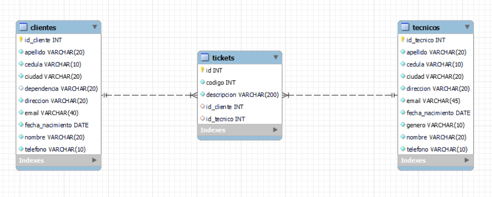

# Asistencia Técnica

API REST desarrollada con Spring Boot para la gestión de asistencia técnica mediante tickets. Esta aplicación permite administrar clientes, técnicos y tickets de soporte de forma sencilla mediante operaciones CRUD.

## 📌 Objetivo

Brindar soporte técnico eficiente mediante la generación y gestión de tickets, asociando cada uno a un cliente y a un técnico asignado.

## 🧑‍💻 Usuarios y entidades

La aplicación maneja tres entidades principales:

- **Cliente**
- **Técnico**
- **Ticket**

Cada ticket está relacionado con un cliente y un técnico que brinda la asistencia correspondiente.

## 🚀 Funcionalidades principales

Se implementan endpoints REST para realizar operaciones CRUD sobre las entidades:

### Cliente
- `GET /cliente` – Listar todos los clientes
- `GET /cliente/{id}` – Obtener un cliente por ID
- `POST /cliente/crear` – Crear un nuevo cliente
- `PUT /cliente/editar/{id}` – Editar cliente existente
- `DELETE /cliente/eliminar/{id}` – Eliminar cliente

### Técnico
- `GET /tecnico` – Listar todos los técnicos
- `GET /tecnico/{id}` – Obtener un técnico por ID
- `POST /tecnico/crear` – Crear nuevo técnico
- `PUT /tecnico/editar/{id}` – Editar técnico existente
- `DELETE /tecnico/eliminar/{id}` – Eliminar técnico

### Ticket
- `GET /ticket` – Listar todos los tickets
- `GET /ticket/{id}` – Obtener un ticket por ID
- `POST /ticket/crear` – Crear nuevo ticket
- `PUT /ticket/editar/{id}` – Editar ticket existente
- `DELETE /ticket/eliminar/{id}` – Eliminar ticket

## ⚙️ Tecnologías utilizadas

- Java 21
- Spring Boot
- Spring Data JPA
- MySQL
- Maven

## 📂 Estructura del proyecto

```bash
src/
├── controller/    # Controladores REST
├── service/       # Lógica de negocio
├── repository/    # Interfaces JPA
├── entity/        # Entidades JPA
├── dto/           # Clases DTO
```

## 🧪 Documentación y pruebas

- Puedes encontrar la colección de pruebas en:
[`docs/postman/Gestion de tickets.postman_collection.json`](docs/postman/Gestion de tickets.postman_collection.json)

## 🔧 Configuración

### Variables de entorno

Crea un archivo `.env` o configura las siguientes propiedades en `application.properties`:

```properties
spring.datasource.url=jdbc:mysql://localhost:3306/gestion_asistencia
spring.datasource.username=usuario
spring.datasource.password=contraseña
spring.jpa.database-platform=org.hibernate.dialect.MySQLDialect
```

##  Compilación y ejecución
Puedes correr el backend directamente desde tu IDE o desde consola:
./mvnw spring-boot:run

## 🗃️ Base de datos

- Base de datos: MySQL

- Las tablas se generan automáticamente mediante JPA.

## 🗺️ Diagrama entidad-relación

Este diagrama muestra la relación entre las entidades principales de la aplicación:




